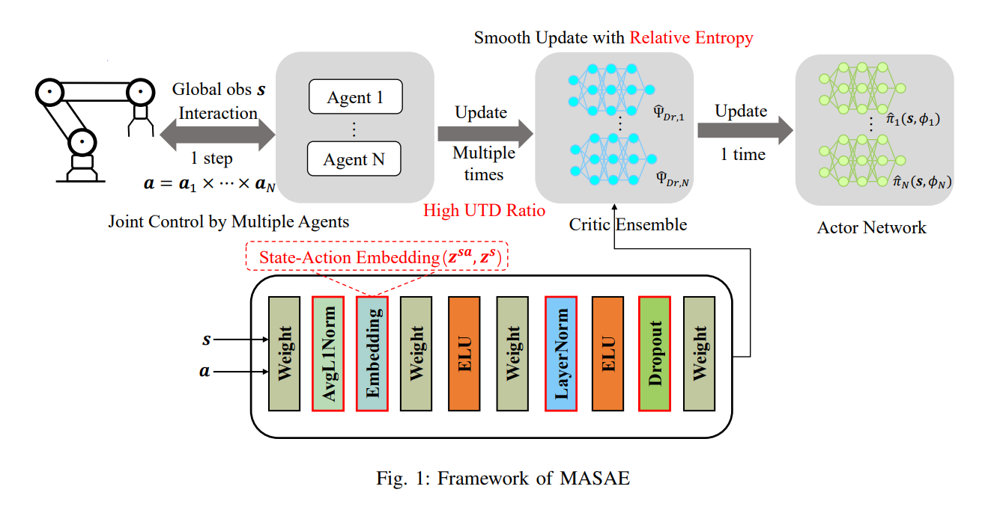

# Sample-efficient Multi-agent Reinforcement Learning with High Update-To-Data Ratio and State-Action Embedding
Code for Paper Sample-efficient Multi-agent Reinforcement Learning with High Update-To-Data Ratio and State-Action Embedding.
This paper is currently submitted to Applied Intelligence for peer review.

Please feel free to contact us regarding to the details of implementing MASAE. (Chenyang Miao: cy.miao@siat.ac.cn Yunduan Cui: cuiyunduan@gmail.com)

## Unitree Go1 robot experiment display
You can see the peformance of MASAE v.s. DroQ with forward walking task of Unitree Go1 in [our video in YouTube](https://www.youtube.com/watch?v=zNFyHsxLUg0). 

## Experiment Config
Here we update two versions of the MASAE code, one for the classic MuJoCo tasks and another for the Unitree A1 sim task.

## Running Experiment
Experiment for a specific configuration can be run using:
``` python
python train.py --config
```

## Visualization
We use VisualDL, a visualization analysis tool of PaddlePaddle to realize the visualization of the exp process. 
